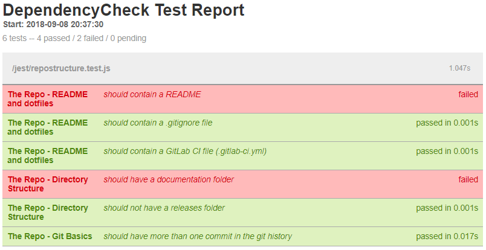

# project-check

Basic Node.js test script to evaluate repository structure, code quality, etc. and an Alpine-based
Docker image so that it can be run against arbitrary projects using GitLab CI

## About project-check

The script uses [Jest](https://jestjs.io/) as a test framework and
[jest-html-reporter](https://github.com/Hargne/jest-html-reporter) as a test reporter to run
basic quality checks against a project and produce a report that can be used along with other
tests, metrics, and analysis to assess project maturity.

The script currently runs the following checks (divided into categories):

* README and dotfiles
  * The project should have a README
  * The project should have a .gitignore file
  * The project should have a GitLab CI file (.gitlab-ci.yml)
* Directory structure
  * The project should have a documentation folder
  * The project's documentation folder should not be empty (WIP)
  * The project should not have a releases folder
* Git basics
  * The project should have more than one commit in its git history

## Install

`$ docker pull pmosbach/project-check`

## Usage

### Basic configuration with GitLab CI

The following is an example job from a `.gitlab-ci.yml` file to use this image to run the Project
Check script against your project:

```yml
project_check:
  stage: code_analysis
  image:
    name: pmosbach/project-check:latest
    entrypoint: [""]
  variables:
    JEST_HTML_REPORTER_PAGE_TITLE: "$CI_PROJECT_NAME Test Report"
  script:
    - jest --config /jest/jest.config.json /jest/
  allow_failure: true
  artifacts:
    when: always
    paths:
      - "./test-report.html"
```

### Report

The test runner will output the test results to the command line and you can see the results in the
job log of your CI job, but it will also produce an HTML report that can be captured as an artifact
(this is both recommended and included in the example job above). Here is an example of the
HTML report:



You can use environment variables to include your project's name in the test report (as shown in
the picture and example CI job), use a different theme for the report or even to include a logo.
See [here](https://github.com/Hargne/jest-html-reporter/wiki/configuration) for available
configuration options.